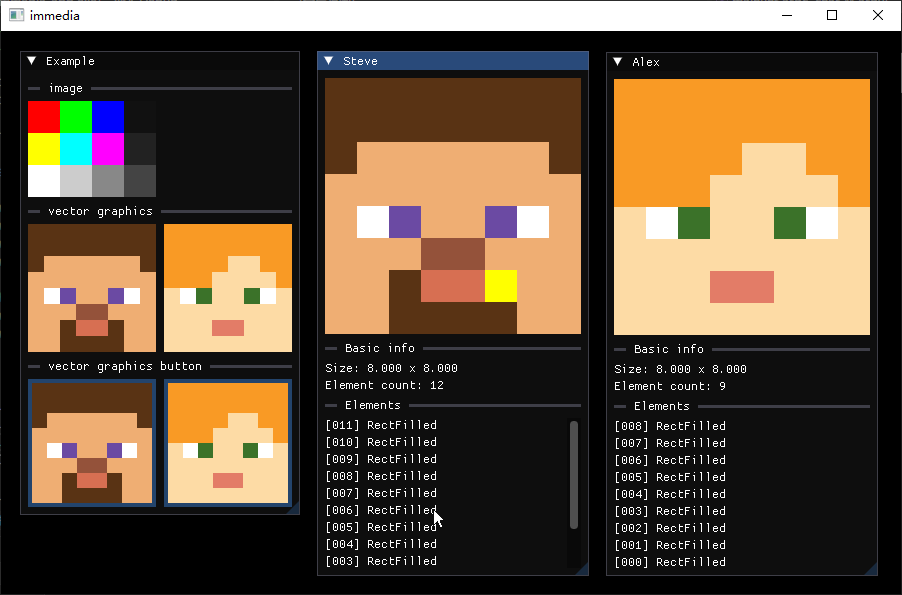
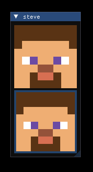

# ImMedia

- [English](../../README.md)
- [中文](./README.md)

---

[imgui](https://github.com/ocornut/imgui) 库的图像拓展



---

- [功能](#功能)
  - [位图](#位图)
  - [矢量图](#矢量图)
- [安装](#安装)
  - [vcpkg](#vcpkg)

## 功能

### 位图

```cpp
#include ...
#include "immeida_image.h"
#include "immeida_decoder_stb.h"
#include "immeida_renderer_sdl2.h"

int main(int argc, char** argv)
{
    // 创建 ImGui 上下文

    // 创建 ImMedia 上下文，安装解码器和渲染器
    ImMedia::CreateContext();
    ImMedia_DecoderStb_Install(DecoderSTBFormat::PNG);
    ImMedia_RendererSDL2_Install();

    { // 注意: ImMedia::Image 生命周期必须处在 ImMedia::CreateContext() 与 ImMedia::DestoryContext() 之间
        ImMedia::Image image("./img.png");
        while(true) // 事件循环
        {
            // ...
            image.show({ 256, 256 }, ImMedia::ImageFillMode::Fill);
            // ...
        }
    }
    
    ImMedia::DestoryContext(); // 不要忘记销毁上下文

    // 销毁 ImGui 上下文

    return 0;
}
```

使用 `Image::GetTexture()` 获取当前 `ImTextureID`

```cpp
ImMedia::Image image("./img.png");
ImGui::ImageButton(image.GetTexture(), { 128, 128 });
```

> 要安装自定义解码器, 请参照 [安装自定义解码器](./Install%20Image%20Decoder.md)

### 矢量图

```cpp
#include "immedia_vector_graphics.h"

int main(int argc, char** argv)
{
    // 创建 imgui 上下文

    // 使用 VectorGraphics 类不需要创建上下文
	ImMedia::VectorGraphics steve({ 8, 8 });
	ImU32 skin_col = IM_COL32(0xEF, 0xAE, 0x73, 0xFF);
	ImU32 hair_col = IM_COL32(0x59, 0x33, 0x14, 0xFF);
	ImU32 eyes_col = IM_COL32(0x6B, 0x4A, 0xA3, 0xFF);
	ImU32 nose_col = IM_COL32(0x94, 0x52, 0x3A, 0xFF);
	ImU32 mouse_col = IM_COL32(0xD7, 0x6F, 0x52, 0xFF);
	ImU32 beard_col = IM_COL32(0x59, 0x33, 0x14, 0xFF);
	steve.AddRectFilled({ 0, 0 }, { 8, 3 }, hair_col);
	steve.AddRectFilled({ 0, 3 }, { 8, 8 }, skin_col);
	steve.AddRectFilled({ 1, 2 }, { 7, 3 }, skin_col);
	steve.AddRectFilled({ 1, 4 }, { 3, 5 }, IM_COL32_WHITE);
	steve.AddRectFilled({ 5, 4 }, { 7, 5 }, IM_COL32_WHITE);
	steve.AddRectFilled({ 2, 4 }, { 3, 5 }, eyes_col);
	steve.AddRectFilled({ 5, 4 }, { 6, 5 }, eyes_col);
	steve.AddRectFilled({ 3, 5 }, { 5, 6 }, nose_col);
	steve.AddRectFilled({ 3, 6 }, { 5, 7 }, mouse_col);
	steve.AddRectFilled({ 2, 6 }, { 3, 7 }, beard_col);
	steve.AddRectFilled({ 5, 6 }, { 6, 7 }, beard_col);
	steve.AddRectFilled({ 2, 7 }, { 6, 8 }, beard_col);
    // ...
    while(...) // 事件循环
    {
        // ...
		steve.Show({ 128, 128 });
		ImMedia::VGButton(vg, { 128, 128 });
        // ...
    }   
    
    // 删除 imgui 上下文

    return 0;
}
```
效果



## 安装

### vcpkg

从 [release](https://github.com/HuaiminNotSleepYet/immedia/releases) 页面下载 `vcpkg-port.zip`，解压后添加到 vcpkg 的端口覆盖.
